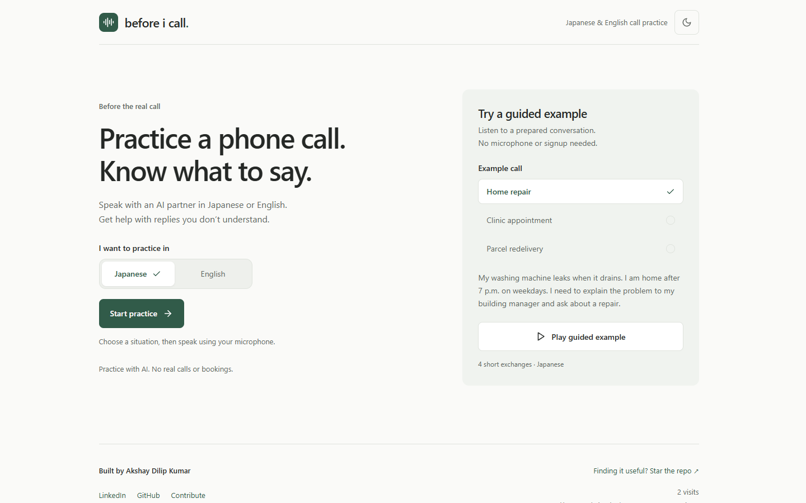
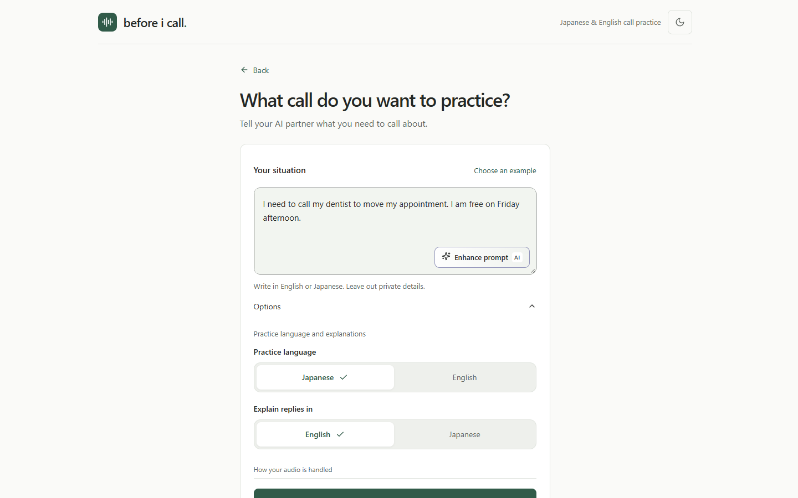
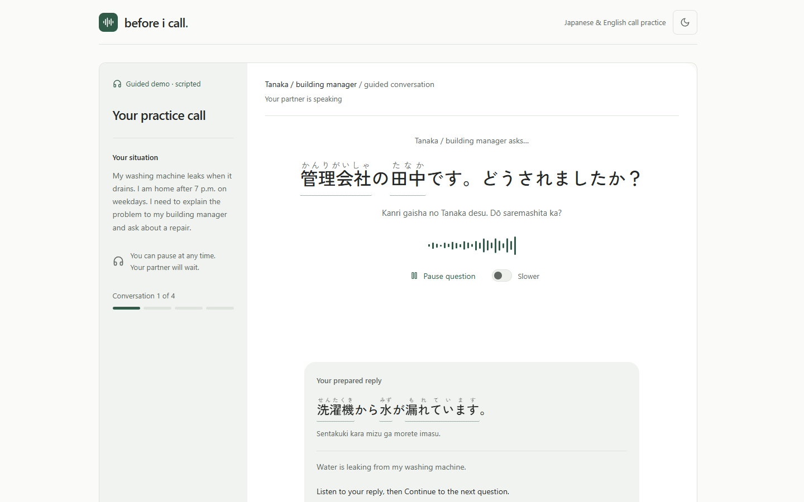
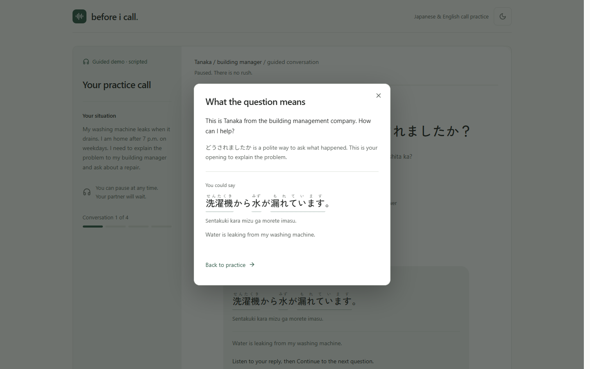
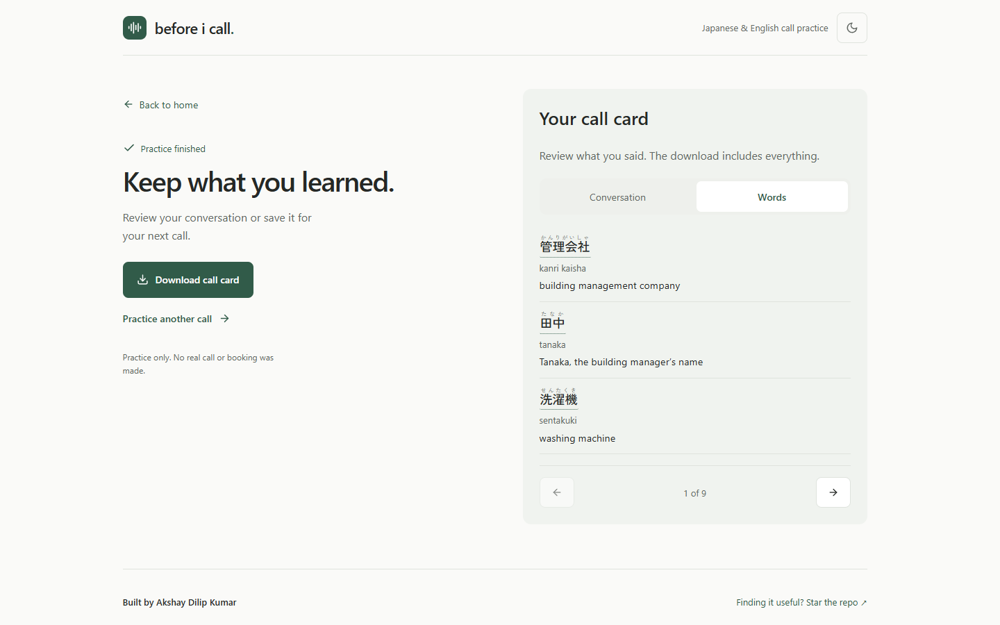
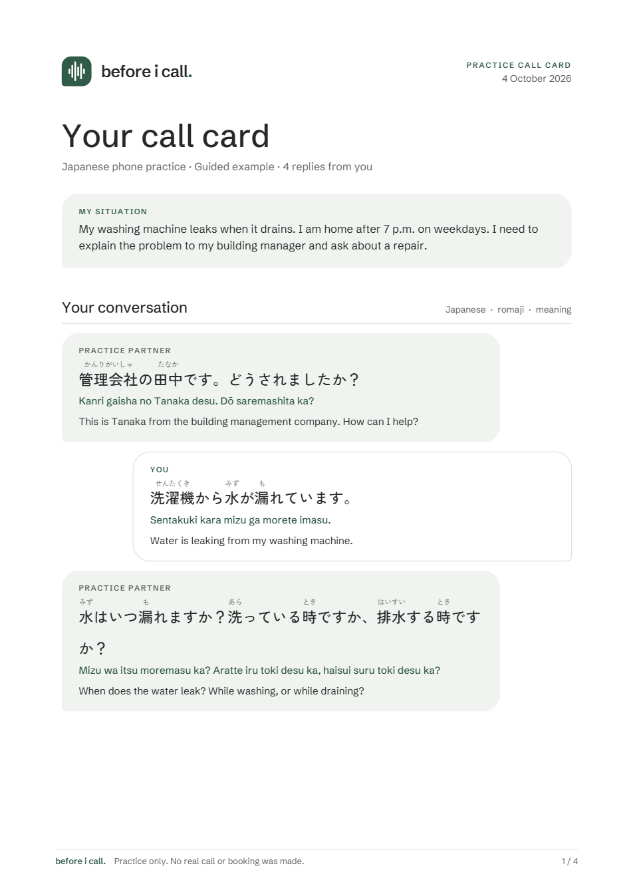
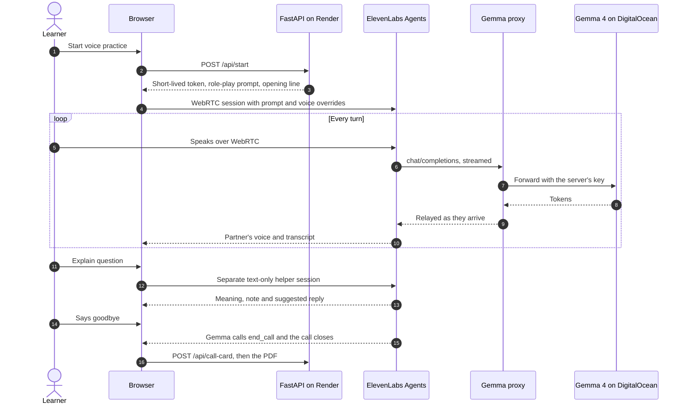
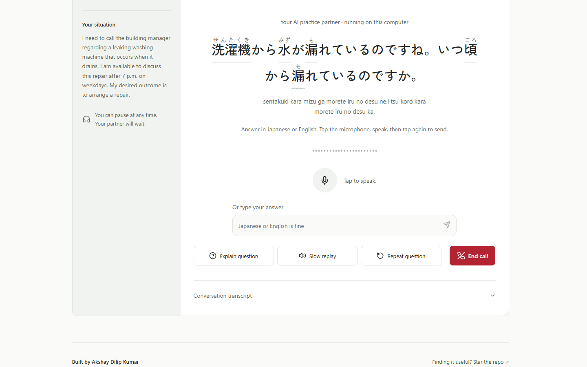
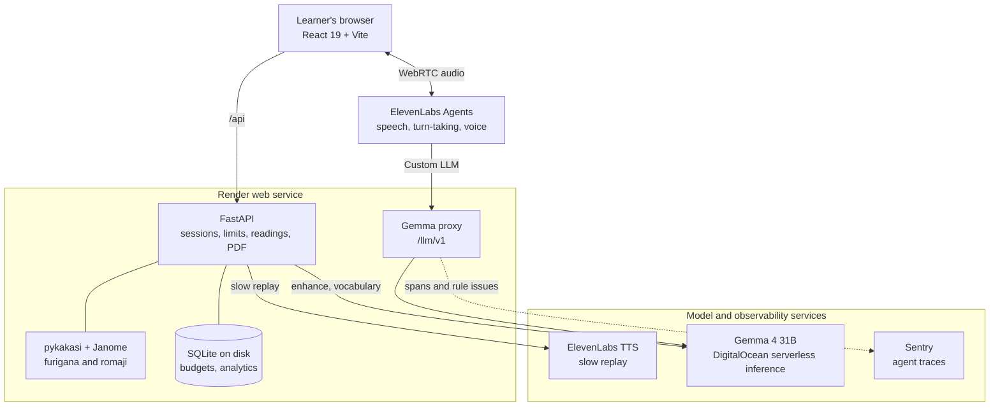

<div align="center">


# Before I Call

### Rehearse the phone call you've been putting off.

A patient AI voice partner for everyday Japanese and English calls, with furigana on every word,<br>
help that never interrupts the conversation, and a call card to take with you.<br>
Use it in the cloud, or <b>free and offline on your own computer</b> with Gemma 4, Whisper and Kokoro.

<a href="https://before-i-call.onrender.com"></a>

<a href="https://deepmind.google/models/gemma/"></a>
<a href="https://elevenlabs.io/agents"></a>
<a href="https://docs.digitalocean.com/products/gradient-ai-platform/how-to/use-serverless-inference/"></a>
<a href="https://docs.sentry.io/product/insights/ai/agents/"></a>
<a href="https://render.com"></a>
<a href="LICENSE"></a>
<a href="#free-local-mode-on-your-own-computer"></a>

<a href="https://dev.to/challenges/hacktoberfest-weekend-2026-10-01"></a>

[**Live app**](https://before-i-call.onrender.com) · [How it works](#how-a-practice-call-works) · [Free local mode](#free-local-mode-on-your-own-computer) · [Architecture](docs/ARCHITECTURE.md) · [Run it locally](#run-it-locally)

<br>

<picture>
  <source media="(prefers-color-scheme: dark)" srcset="docs/images/home-dark.png">
  
</picture>

</div>

## The problem

A phone call is the hardest everyday conversation in a second language. There is no face to read and no time to look anything up, and the other person speaks at native speed. People who live in Japan put off calling the building manager, the clinic or the delivery company, not because they can't manage the conversation, but because the call itself feels risky.

Phrasebooks help with the first sentence. They don't help with the reply nobody predicted.

**Before I Call gives you a safe place to have that call first.** Describe what you need, talk it through with a patient AI partner who plays the receptionist or the building manager, pause whenever a reply loses you, and leave with every phrase written down, readings included. It was built first for one person: an Indian resident living alone in Tokyo.

## What you can do

<table>
  <tr>
    <td width="50%" valign="top">
      
      <h3>🎯 Rehearse your real situation</h3>
      Pick a preset (home repairs, clinic, missed delivery, city office, dietary requests, lost property, bills) or describe your own. <b>Enhance prompt</b> turns rough notes into a clear situation without inventing facts.
    </td>
    <td width="50%" valign="top">
      
      <h3>🗣️ Talk to a patient partner</h3>
      A live voice partner in polite Japanese or clear English. One question at a time, it waits for you, and it never grades. Speak, or type when you're stuck.
    </td>
  </tr>
  <tr>
    <td width="50%" valign="top">
      
      <h3>💡 Understand without hanging up</h3>
      <b>Explain question</b> pauses the call and opens a separate helper with the meaning, a note and a reply you could say. <b>Slow replay</b> and <b>Repeat question</b> are one tap away.
    </td>
    <td width="50%" valign="top">
      
      <h3>📇 Keep what you learned</h3>
      Every turn with furigana, romaji and meaning, plus useful words picked from your own conversation, then <b>Download call card</b> for a branded PDF.
    </td>
  </tr>
</table>

<table>
  <tr>
    <td width="62%" valign="top">
      <h3>📄 A call card you can print</h3>
      The PDF puts your situation first, then each turn as a speech bubble with furigana over the kanji, romaji and an English meaning, then a grid of useful words. Fonts are embedded, so the Japanese renders in any viewer.
      <h3>🔤 Read Japanese you can't read yet</h3>
      Native ruby furigana on every kanji, romaji under every sentence, and English meanings on hover, focus or tap. Readings come from open-source pykakasi and Janome running on the server, with no model call per sentence.
      <h3>🎧 Try it with nothing set up</h3>
      Three guided demos in each language with prerecorded voices for both sides. No account, no key, no microphone.
      <h3>📱 Works on your phone, in light or dark</h3>
      Responsive down to narrow phones, keyboard accessible, and it follows your system theme or your own choice.
    </td>
    <td width="38%" valign="top">
      
    </td>
  </tr>
</table>

## How a practice call works

The browser talks to ElevenLabs directly for audio. Every time the partner needs to answer, ElevenLabs calls this app's own Custom LLM proxy, which streams the reply from **Gemma 4** on DigitalOcean back as it is generated, so the voice starts speaking on the first words.



The full set of diagrams, including help, slow replay, reading support, the call card and the call's state machine, is in [the architecture doc](docs/ARCHITECTURE.md#how-a-conversation-request-runs).

## Free local mode on your own computer

Clone the repo and you can practise for free, offline, with nothing leaving your computer. Set `LOCAL_VOICE=1` and every paid service is swapped for an open model running on your own machine:

| Job | Hosted app | Free local mode | Licence |
| --- | --- | --- | --- |
| Hearing you | ElevenLabs Agents | [Whisper](https://github.com/SYSTRAN/faster-whisper) small, through faster-whisper | MIT |
| The partner's brain | Gemma 4 31B on DigitalOcean | [Gemma 4 E2B](https://ollama.com/library/gemma4) in Ollama | Apache 2.0 |
| The partner's voice | ElevenLabs | [Kokoro-82M](https://huggingface.co/hexgrad/Kokoro-82M) | Apache 2.0 |
| Knowing when you've finished | ElevenLabs turn-taking | Tap to speak, tap again to send | |

**Explain question**, **Slow replay**, **Enhance prompt**, call-card vocabulary, furigana and the PDF all work in local mode too, and the daily usage limits switch off because the compute is yours.

<table>
  <tr>
    <td width="55%" valign="top">

**Set it up once**

1. Install [Ollama](https://ollama.com), then download the model:<br>`ollama pull gemma4:e2b-it-qat` (4.3 GB)
2. Install the speech packages into the app's environment. No compiler is needed, Windows included:<br>`.venv/Scripts/python.exe -m pip install -r requirements-local.txt`
3. Add `LOCAL_VOICE=1` to your `.env` and start the app as usual.

The first run downloads Whisper (464 MB) and Kokoro (313 MB). Both then load in the background when the server starts, so the first call doesn't wait.

**How fast it is** on a laptop with a Ryzen 9 5900HS, Whisper and Kokoro on the CPU, and Gemma on an RTX 3060 with 6 GB: the opening line starts in about 2 seconds, a spoken answer gets a spoken reply in about 6 seconds, and an explanation takes under 2 seconds.

**The trade-offs:** replies are slower than the hosted voice, you tap to talk rather than interrupting naturally, and the small Gemma follows the role-play rules less precisely than the 31B model. With more memory, `gemma4:e4b-it-qat` is noticeably smarter: set `LOCAL_LLM_MODEL`.

  </td>
    <td width="45%" valign="top">
      
    </td>
  </tr>
</table>

## Architecture



| Piece | Role |
| --- | --- |
| **Gemma 4 31B** (open weights) on **DigitalOcean** serverless inference | The one model behind every language decision: the practice partner, the question helper, the situation editor and the vocabulary picker |
| **ElevenLabs Agents** | The live call: WebRTC audio, speech recognition, turn-taking, the voice, the `end_call` tool and a 6,107-entry pronunciation dictionary for Japanese dates and counters |
| **ElevenLabs Text to Speech** | Slow replay at 0.7 speed, and the prerecorded guided-demo voices |
| **FastAPI** | Issues short-lived sessions, enforces cost limits, serves readings, call cards and PDFs, and hosts the Gemma proxy |
| **pykakasi + Janome** | Open-source Japanese readings and romaji, in-process and free |
| **reportlab** | The A4 PDF call card with embedded brand fonts |
| **Sentry** | `gen_ai` agent spans for every Gemma request, one issue per broken role-play rule, and learner reports linked to the exact turn |
| **Render** | Docker deploy from `render.yaml` with a persistent disk for the SQLite ledger |
| **React 19 + TypeScript + Vite** | The interface, with zod validating every response |
| **Whisper, Kokoro and Gemma 4 E2B in Ollama** | [Free local mode](#free-local-mode-on-your-own-computer): the same practice with every model running on your own computer |

## Open-source AI at the core

- **One open-weight model makes every language decision.** Gemma 4 plays the receptionist, explains the question, tidies up the situation and picks the vocabulary. The role-play prompt is written and tuned for Gemma, and the app checks every reply it gives against the rules of the rehearsal: it must hang up when the learner says goodbye, never confirm a booking, and speak counters in kana rather than digits.
- **Grounded output.** Vocabulary Gemma suggests is kept only if it appears word for word in your transcript.
- **Reading support needs no model at all.** Furigana and romaji come from the open-source pykakasi and Janome libraries running inside the app, so they are instant, free and private.
- **Fully open when you run it yourself.** In [free local mode](#free-local-mode-on-your-own-computer), Whisper (MIT) hears you, Gemma 4 (Apache 2.0) answers through Ollama, and Kokoro (Apache 2.0) speaks: no keys, no bills, and your practice never leaves your computer. Swapping a model is one setting.
- **MIT licensed**, including the prompts, rule checks and pronunciation dictionary.
- **What isn't open:** in the hosted app, the voice layer (ElevenLabs), tracing (Sentry) and hosting (Render) are services.

## Privacy and safety

- **Transcripts stay in your browser.** The server reads them to build your call card and does not save them.
- **No recordings.** The app never stores microphone audio.
- **Keys stay on the server.** The browser only ever receives a short-lived conversation token.
- **Honest rehearsal.** The partner never invents dates, prices or availability, never confirms a booking, and asks for made-up details instead of real ones.
- **Traces hold no conversation text**, unless a learner chooses to attach a reply to a report.
- **Usage analytics count actions, not words.** They store no text, audio, IP addresses or referrers.

## Run it locally

You need Node 22 and Python 3.12. The guided demos work without any keys, and [free local mode](#free-local-mode-on-your-own-computer) adds voice practice without any keys either.

```bash
git clone https://github.com/adkbbx/before_I_call-.git
cd before_I_call-
npm ci
npm run build
python -m venv .venv
.venv/Scripts/python.exe -m pip install -r requirements.txt     # macOS/Linux: .venv/bin/python
.venv/Scripts/python.exe -m uvicorn server.app:app --port 8000
```

Open http://127.0.0.1:8000. For frontend work, run `npm run dev` as well; Vite proxies `/api` to port 8000 and serves the demo audio from `public/`.

<details>
<summary><b>Set up live voice</b></summary>

<br>

1. Copy `.env.example` to `.env` and set `ELEVENLABS_API_KEY`, `ELEVENLABS_AGENT_ID` and `ELEVENLABS_VOICE_ID` (a Japanese voice for slow replay). The key needs **ElevenAgents Read** to issue conversation tokens and **Text to Speech** for slow replay. The configuration scripts also need **ElevenAgents Write**, and the pronunciation script needs **pronunciation dictionary Read/Write**.
2. Create a dedicated agent with Japanese as its language, a Japanese voice, authentication enabled and voice recording disabled.
3. Run `.venv/Scripts/python.exe scripts/configure-agent.py`. It allows the prompt, first message, language, voice and text-only overrides the app uses, enables the built-in `end_call` tool, and matches the agent's maximum duration to `MAX_CALL_SECONDS`.
4. Set the agent's LLM to a Custom LLM with model `gemma-4-31B-it` and the Chat Completions API, and set the backup LLM to Disabled so a provider error ends the turn instead of silently switching models. Then set `GRADIENT_MODEL_ACCESS_KEY` and `LLM_PROXY_KEY`, deploy, and run `.venv/Scripts/python.exe scripts/configure-llm-proxy.py https://<your-app>` to point the agent at the app's traced proxy. `--rollback` points it straight back at DigitalOcean.
5. Run `.venv/Scripts/python.exe scripts/configure-pronunciation.py` to install the shared kana aliases as a pronunciation dictionary. Rerun it after editing `server/pronunciation.py`, then start a new call to hear the change.

Every script accepts `--help`, which prints usage without contacting ElevenLabs. English practice uses the Sarah voice by default; set `ELEVENLABS_ENGLISH_VOICE_ID` to change it.

</details>

<details>
<summary><b>Configuration reference</b></summary>

<br>

| Variable | Purpose | Default |
| --- | --- | --- |
| `ELEVENLABS_API_KEY`, `ELEVENLABS_AGENT_ID` | Live voice | required for live |
| `ELEVENLABS_VOICE_ID` | Japanese slow-replay voice | none |
| `ELEVENLABS_ENGLISH_VOICE_ID` | English voice | Sarah |
| `GRADIENT_MODEL_ACCESS_KEY` | Gemma on DigitalOcean: proxy, enhancement, vocabulary | none |
| `GRADIENT_MODEL` | The only model the proxy forwards | `gemma-4-31B-it` |
| `LLM_PROXY_KEY` | The key the agent's Custom LLM sends to `/llm/v1` | none |
| `SENTRY_DSN` | Agent tracing and learner reports | none |
| `APP_ORIGIN` | Exact public origin, no trailing slash | request origin |
| `LIVE_ACCESS_CODE` | Optional code required for live sessions and enhancement | none |
| `ANALYTICS_ADMIN_KEY`, `ANALYTICS_DB_PATH` | `/analytics` dashboard and SQLite location | `work/analytics.sqlite3` |
| `MAX_CALL_SECONDS`, `MAX_CONCURRENT_CALLS` | Call length and simultaneous calls | `120`, `2` |
| `MAX_CALLS_PER_VISITOR_DAY`, `MAX_DAILY_CALL_SECONDS` | Daily live budget per browser and per site | `3`, `12000` |
| `LOCAL_VOICE` | `1` turns on free local mode (Whisper, Gemma in Ollama, Kokoro) | off |
| `LOCAL_LLM_MODEL`, `LOCAL_LLM_URL` | The Ollama model and its OpenAI-compatible address | `gemma4:e2b-it-qat`, `http://127.0.0.1:11434/v1` |
| `LOCAL_STT_MODEL`, `LOCAL_VOICE_JA`, `LOCAL_VOICE_EN` | Whisper size and Kokoro voices | `small`, `jf_alpha`, `af_heart` |

The full list, including help, replay, enhancement, vocabulary and report limits, is in [`.env.example`](.env.example).

</details>

## Deploy to Render

[](https://render.com/deploy?repo=https://github.com/adkbbx/before_I_call-)

The Blueprint in `render.yaml` builds the Docker image (frontend and backend in one service), attaches a 1 GB persistent disk at `/var/data` for the SQLite ledger and analytics, generates `ANALYTICS_ADMIN_KEY`, and health-checks `/api/health`. Then:

1. Set the ElevenLabs, DigitalOcean, `LLM_PROXY_KEY` and `SENTRY_DSN` secrets in the service's Environment settings. Local `.env` values do not transfer.
2. Set `APP_ORIGIN` to the exact Render origin, without a trailing slash.
3. Keep **one instance**: live-call admission and replay caches live in memory.
4. Set the agent's maximum duration to `MAX_CALL_SECONDS`. The browser timer alone is not authoritative.

## Cost controls

Every live call reserves its full two minutes before a token is issued, so the daily budget holds even when every call runs to the limit.

| Limit | Default |
| --- | --- |
| Call length | 2 minutes |
| Simultaneous calls | 2 |
| Live calls per browser per day | 3 |
| Live minutes per site per day | 200 (100 full calls) |
| Explanations and fresh replays per call | 6 each |
| Situation enhancements per browser / site per day | 5 / 100 |
| Vocabulary requests per browser / site per day | 3 / 100 |

Details are in [cost controls](docs/COST_CONTROLS.md).

## Tests

```bash
npm test                                              # guided demo flow, call card text, demo audio
npm run build                                         # strict TypeScript check and production bundle
.venv/Scripts/python.exe -m unittest discover -s tests  # 80 tests: API, limits, proxy, tracing, readings, PDF, local mode
```

Provider calls, Ollama, Whisper and Kokoro are mocked, so the suites spend no credits and need no models. The audio-decoding test runs once `requirements-local.txt` is installed. A real voice call still needs a person to judge audio quality and latency.

## Documentation

| Doc | What's inside |
| --- | --- |
| [Architecture](docs/ARCHITECTURE.md) | Product design, every component, and Mermaid diagrams of each request |
| [Agent tracing](docs/AGENT_TRACING.md) | Sentry spans, rule checks and learner reports |
| [Cost controls](docs/COST_CONTROLS.md) | Budgets, caches and limits |
| [Pronunciation](docs/pronunciation.md) | The kana alias dictionary, its coverage and sources |
| [Design](DESIGN.md) | Type, colour, layout and flows |
| [Product](PRODUCT.md) | Users, purpose and principles |
| [Demo audio](public/audio/PROVENANCE.md) | How the guided-demo voices were made |
| [Contributing](CONTRIBUTING.md) | How to help |

## Hacktoberfest 2026

Built for the [Hacktoberfest Weekend Challenge: Build for a Friend](https://dev.to/challenges/hacktoberfest-weekend-2026-10-01) on DEV, October 2 to 5, 2026. Changes made after the submission deadline (October 5, 06:59 UTC) will be listed here.

## Credits

- Guided-demo voices from ElevenLabs: Kaito asks and Nao replies in Japanese; Sarah asks and Roger replies in English. They are synthetic voices in fictional practice conversations, not recordings of real people.
- [Schibsted Grotesk](https://fonts.google.com/specimen/Schibsted+Grotesk) and [Zen Kaku Gothic New](https://fonts.google.com/specimen/Zen+Kaku+Gothic+New) under the SIL Open Font License.
- [pykakasi](https://codeberg.org/miurahr/pykakasi), [Janome](https://github.com/mocobeta/janome), [reportlab](https://www.reportlab.com/opensource/) and [lucide](https://lucide.dev) icons.
- Pronunciation research from the Japan Foundation's Marugoto materials. See [sources](docs/pronunciation.md#research-sources).

## License

MIT. See [LICENSE](LICENSE).

<div align="center">
<br>
Built by <a href="https://github.com/adkbbx">Akshay Dilip Kumar</a> · <a href="https://www.linkedin.com/in/akshaydilipkumar/">LinkedIn</a> · Finding it useful? <a href="https://github.com/adkbbx/before_I_call-">Star the repo</a>
</div>
