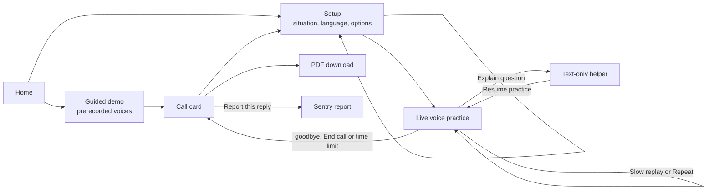
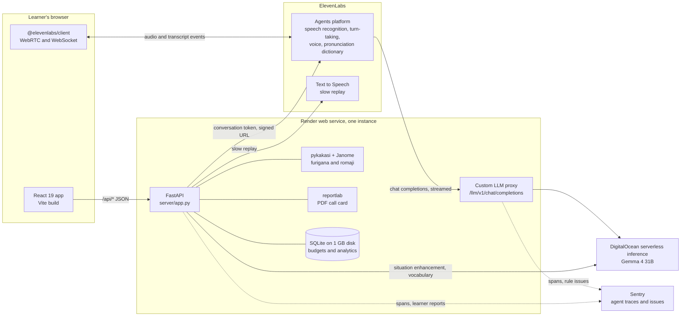
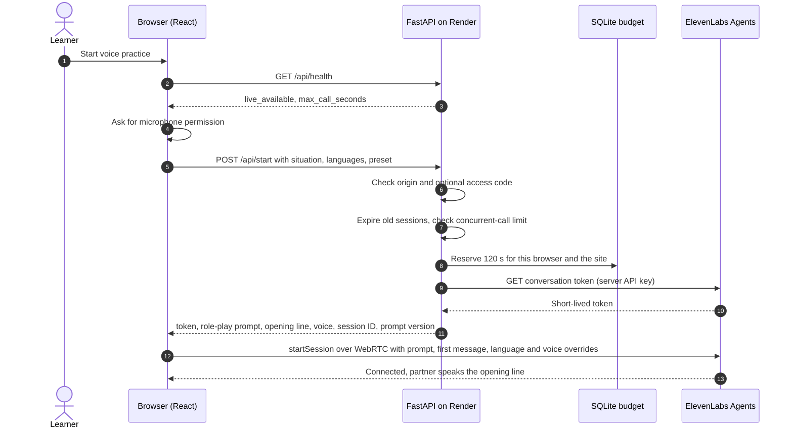
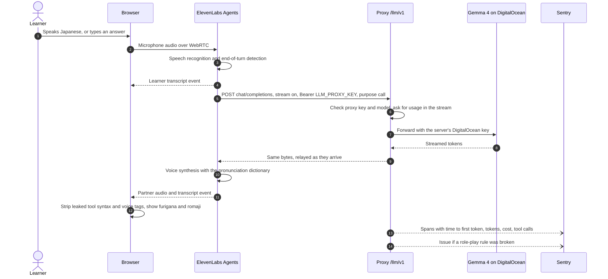
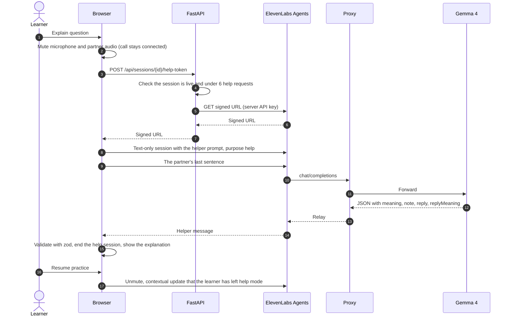
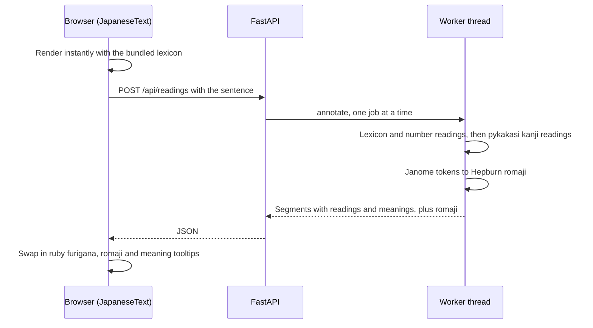
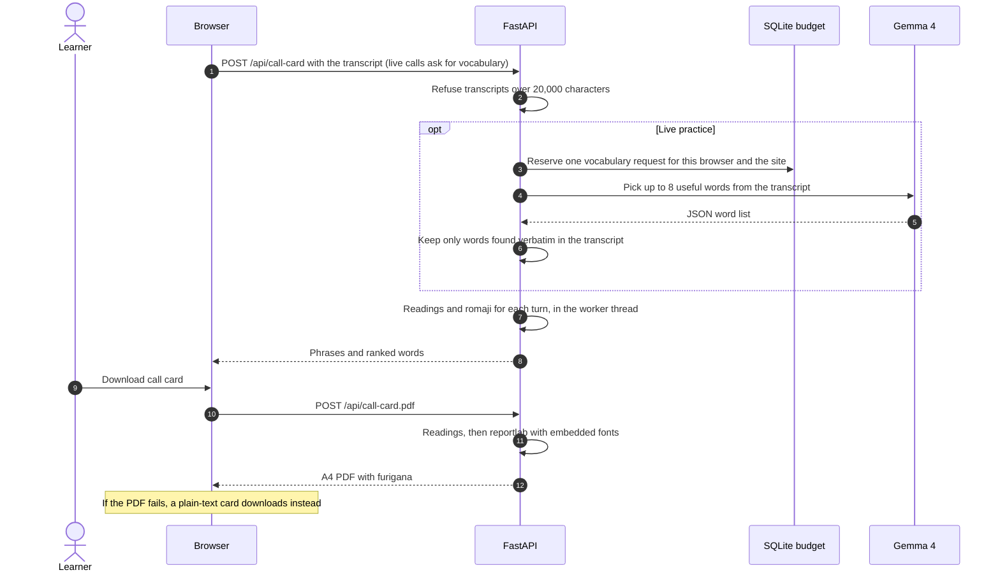
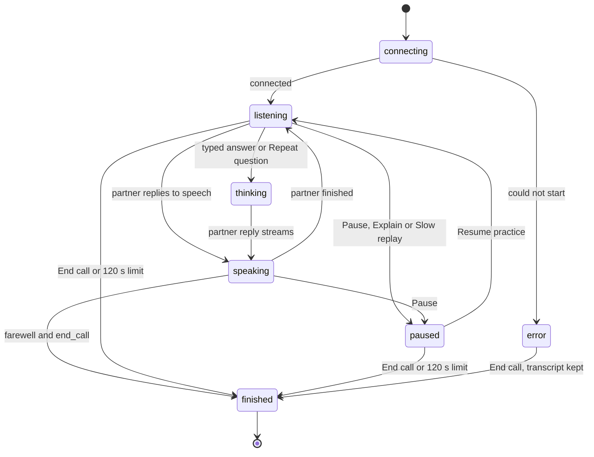
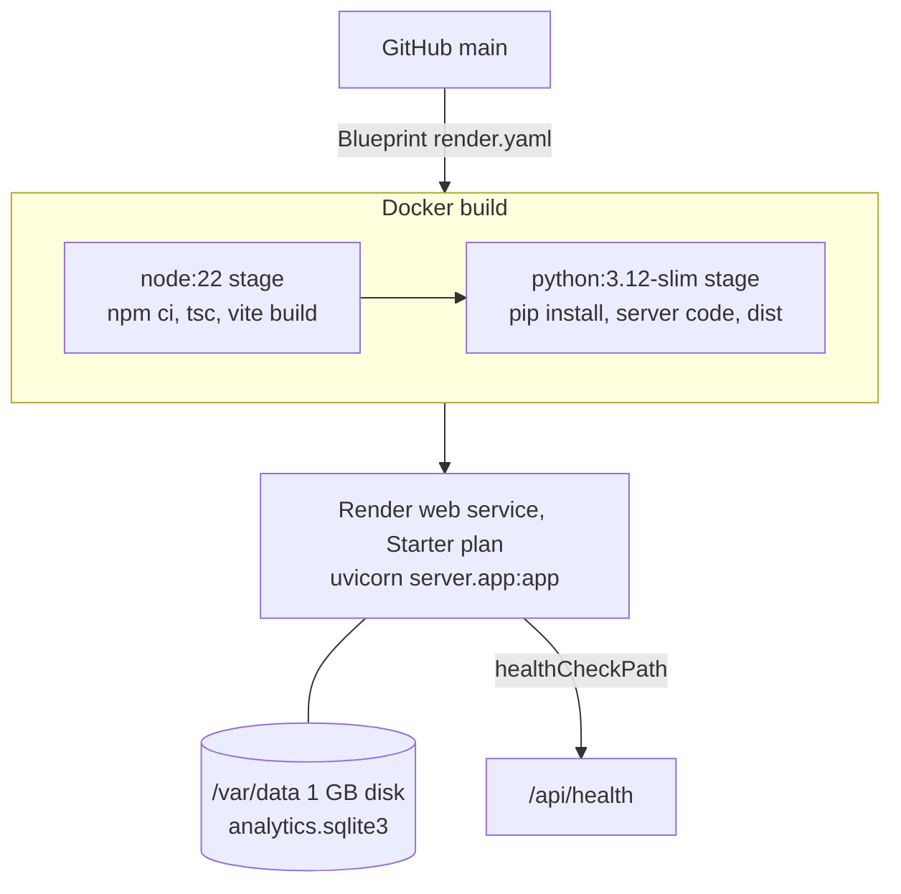

# Before I Call: product design and architecture

This document explains what Before I Call is for, how it is designed, and how every component works together, from the learner pressing **Start voice practice** to the call card they download at the end. Diagrams use Mermaid and render on GitHub.

- [Product design](#product-design)
- [System at a glance](#system-at-a-glance)
- [Components and how each is used](#components-and-how-each-is-used)
- [How a conversation request runs](#how-a-conversation-request-runs)
- [Data, privacy and storage](#data-privacy-and-storage)
- [Cost and abuse controls](#cost-and-abuse-controls)
- [Observability](#observability)
- [Deployment](#deployment)
- [Testing](#testing)
- [Design decisions and trade-offs](#design-decisions-and-trade-offs)
- [Code map](#code-map)

## Product design

### The problem

A phone call is the hardest everyday conversation in a second language. There is no face to read, no gestures, no time to look anything up, and the other person speaks at native speed. People who live in Japan put off calls to the building manager, the clinic or the delivery company because the call itself feels risky, even when they could manage the same conversation in writing. Phrasebooks help with the first sentence. They do not help with the reply nobody predicted.

### Who it is for

Residents of Japan who need to make everyday calls in Japanese, and Japanese speakers who want the same rehearsal for English calls. The first user is an Indian resident living alone in Tokyo. The app also has to give judges and first-time visitors a frictionless demonstration, with no account and no microphone.

### What the learner gets

| Need | How Before I Call answers it |
| --- | --- |
| Rehearse a real situation | Seven editable presets (home repairs, clinic, missed delivery, city office, dietary requests, lost property, bills) or the learner's own situation, optionally tidied up by **Enhance prompt** |
| A patient partner | A live voice partner that speaks polite Japanese (or clear English), asks one question at a time, waits, and never grades |
| Understand a reply without losing the call | **Explain question** pauses the call and opens a separate text-only helper, so the explanation never enters the role-play transcript. **Resume practice** continues the same call |
| Hear it again | **Slow replay** re-synthesizes the last question at 0.7 speed. **Repeat question** asks the partner to say it again |
| Read Japanese they cannot yet read | Furigana over every kanji, romaji under every sentence, and English meanings on hover, focus or tap |
| Keep what they learned | A call card with every turn, readings, meanings and useful words, downloadable as a branded A4 PDF with furigana |
| Try it with nothing set up | Three guided demos per language with prerecorded voices for both sides. No key, account or microphone needed |

### Product principles

1. **Give the learner time.** Pausing is always available, the partner waits, and there are no scores, streaks or timers that judge.
2. **Never break the conversation to help.** Help happens beside the call, not inside it.
3. **Make failure recoverable.** Every network or provider failure has a fallback: local readings, text card instead of PDF, agent repeat instead of replay, demo instead of live.
4. **Honest rehearsal.** The partner never invents dates, prices or availability, never confirms a booking, and asks for made-up personal details. The home page and the call card both say no real call or booking was made.
5. **Privacy by default.** Transcripts stay in the browser. The server keeps counters, not conversations.

### User journeys



## System at a glance

One Docker service on Render runs a FastAPI backend that also serves the built React app. The browser talks to ElevenLabs directly for audio, and ElevenLabs calls back into the app's own proxy for every Gemma turn.



## Components and how each is used

### In the browser

| Component | What it does here |
| --- | --- |
| **React 19 + TypeScript + Vite** (`src/`) | The whole interface: home, setup, guided demo, live call, explanation dialog, call card and the `/analytics` dashboard. Strict TypeScript, no router: the view is a small state machine in `App.tsx` |
| **@elevenlabs/client** | Opens the live voice session over WebRTC with the token from `/api/start`, and the text-only help session over WebSocket with a signed URL. Passes prompt, first message, language and voice overrides, plus `customLlmExtraBody` labels for tracing |
| **zod** | Validates every API response and the helper's JSON before it reaches the UI |
| **JapaneseText** (`src/JapaneseText.tsx`) | Renders ruby furigana, romaji and accessible meaning tooltips. Uses server readings when available and a bundled 62-entry lexicon as an instant fallback |
| **Saved demo audio** (`public/audio/`) | 40 prerecorded WAV clips, both sides of three Japanese and three English demos. URLs carry content hashes so a regenerated clip is never served from a stale cache |
| **Self-hosted fonts** | Schibsted Grotesk for Latin text and Zen Kaku Gothic New for Japanese, from Fontsource |

### On the server

| Component | What it does here |
| --- | --- |
| **FastAPI + uvicorn** (`server/app.py`) | Issues live sessions, enforces limits, serves readings, call cards and PDFs, proxies replay audio, takes learner reports and serves the built frontend |
| **Custom LLM proxy** (`server/llm_proxy.py`) | The ElevenLabs agent's Custom LLM URL. Accepts only the agent's `LLM_PROXY_KEY` and the configured Gemma model, forwards to DigitalOcean with the server's key, streams the reply back byte for byte, and measures it on the way through |
| **Reply rules** (`server/reply_rules.py`) | Checks every practice reply against the role-play rules: missed hang-up, claimed booking, digits or Latin letters in Japanese speech |
| **Readings** (`annotate`, `romanize` in `server/app.py`) | Curated lexicon and number readings first, then **pykakasi** for kanji readings and **Janome** morphological analysis for natural romaji, with particles は/へ/を read as wa/e/o. Runs in-process with no model call, in a worker thread, one job at a time |
| **Pronunciation** (`server/pronunciation.py`, `server/counter_pronunciation.py`) | 6,107 kana aliases for dates, clock times, durations and counters (7時 → しちじ, 10分 → じゅっぷん). Installed on the live agent as a pronunciation dictionary and applied to slow replay and demo audio generation |
| **Call openings** (`server/call_opening.py`) | Picks the partner's first line from the situation (dental reception, clinic, building management…) without another model request |
| **Situation editor** (`server/preparation.py`) | **Enhance prompt**: Gemma rewrites rough notes into a clear first-person situation in the same language, never inventing facts |
| **Vocabulary picker** (`server/vocabulary.py`) | Gemma picks up to eight useful words from the finished transcript. Any word that is not a verbatim substring of the transcript is discarded |
| **PDF call card** (`server/call_card_pdf.py`) | reportlab builds an A4 card with speech-shaped turns, furigana over kanji, romaji, meanings and a word grid. Brand fonts are bundled (OFL) and subset into each file. User text is escaped, never read as markup |
| **Cost limits** (`server/cost_limits.py`) | Durable daily admission budgets for live calls in SQLite |
| **Analytics** (`server/analytics.py`) | First-party, enum-only event counts and an admin-key dashboard. No text, audio, IP addresses or referrers |
| **Tracing** (`server/llm_tracing.py`) | Sentry `gen_ai` spans for every Gemma request: time to first token, tokens, estimated cost, tool calls and quality flags |

### External services

| Service | How Before I Call uses it |
| --- | --- |
| **ElevenLabs Agents** | The live call itself: WebRTC audio, speech recognition, turn-taking and interruption, the Japanese or English voice, the built-in `end_call` tool, the pronunciation dictionary, and a Custom LLM pointed at this app's proxy. A second, text-only session powers **Explain question** |
| **ElevenLabs Text to Speech** | **Slow replay** and **Listen to explanation**, with `eleven_flash_v2_5` at speed 0.7. Prerecorded demo clips were generated with Multilingual v2 and Eleven v3 |
| **Gemma 4 31B on DigitalOcean serverless inference** | The one model behind every language decision: the practice partner's turns, the question helper, the situation editor and the vocabulary picker. Reached through an OpenAI-compatible Chat Completions API |
| **Sentry** | Agent tracing (Insights → AI → Agents), one issue per broken role-play rule, and learner reports linked to the exact traced turn |
| **Render** | Docker deploy from `render.yaml`, health checks on `/api/health`, and a 1 GB persistent disk for the SQLite ledger and analytics |

## How a conversation request runs

### 1. Starting a live call

The browser checks availability and microphone permission before asking the server for anything that costs money. The server admits the call, reserves its full duration in the daily budget, and returns a short-lived ElevenLabs conversation token. The API key never leaves the server.



If the token request fails, the reservation is released. If every line is busy or today's budget is used, the learner gets a plain message and the guided demo is still one click away.

### 2. One conversation turn

This is the request that repeats for every exchange. ElevenLabs recognizes the learner's speech, decides the learner has finished, and asks the Custom LLM for the partner's reply. That LLM is this app's proxy, which forwards to Gemma on DigitalOcean and streams the answer straight back so the voice can start speaking on the first tokens.



When the learner says goodbye, the prompt tells Gemma to say one farewell and call `end_call` in the same turn. ElevenLabs executes the tool and disconnects, and the browser opens the call card. Two safety nets cover the cases where that does not happen: the browser ends the call itself if Gemma writes `end_call(...)` as text, and a timer ends it at the 120-second limit, which the agent's own maximum duration also enforces.

### 3. Explain question

Help runs in a separate, short-lived text-only session, so the explanation never appears in the role-play transcript and the partner never loses its place.



**Slow replay** is simpler: the browser posts the last sentence to `/api/sessions/{id}/speech`, the server applies the pronunciation aliases, serves a cached clip or asks ElevenLabs Text to Speech for a 0.7-speed version (up to six per call), and returns MP3. If replay is unavailable, the browser asks the live partner to repeat the sentence slowly instead.

### 4. Reading support on every sentence



### 5. Finishing: call card and PDF



After a live practice, every partner reply on the card has **Report this reply**. The report goes to Sentry tagged with the conversation reference, turn number and prompt version, next to that turn's trace. Reply text is attached only if the learner ticks the box.

### Live call states



## Data, privacy and storage

| Data | Where it lives | Retention |
| --- | --- | --- |
| Transcript | Browser memory during and after the call | Until the tab closes. The server reads it for readings, vocabulary and the PDF and does not persist it |
| Audio | ElevenLabs, under the agent's privacy settings | The app never records or stores microphone audio. Configure the agent with voice recording disabled |
| Situation text | Browser; sent to ElevenLabs as part of the prompt and to Gemma when enhanced | Not stored by the app |
| Live session | Server memory: ID, creation time, help and replay counters | Expires 60 s after the call limit |
| Generated replay audio | Server memory cache, 16 MiB and 128 entries at most | 10 minutes, cleared when the call ends |
| Budgets | SQLite: random browser ID, UTC day, reserved seconds or request count | Pruned daily |
| Analytics | SQLite: random browser and visit IDs, event name, enum-only properties | Events 90 days, lifetime visit counts kept |
| Traces | Sentry: timing, tokens, cost, tool names, rule flags, hashed conversation reference | Sentry project retention. No conversation text, except a reply a learner chooses to attach to a report |

Provider keys exist only as server environment variables. The browser receives a short-lived conversation token or signed URL, never a key. Browser requests that spend money check the `Origin` header, and the optional `LIVE_ACCESS_CODE` restricts live sessions and enhancement.

## Cost and abuse controls

| Control | Default |
| --- | --- |
| Live call length (browser timer and agent maximum duration) | 120 s |
| Concurrent live calls on the instance | 2 |
| Live calls per browser per UTC day | 3 |
| Live seconds per site per UTC day, reserved at admission | 12,000 (100 full calls) |
| Help sessions / fresh replays per call | 6 / 6 |
| Situation enhancements per browser / per site per day | 5 / 100 |
| Vocabulary requests per browser / per site per day | 3 / 100 |
| Learner reports per call / per day | 5 / 200 |
| Analytics events per visit per hour | 500 |
| Call card transcript size | 20,000 characters |
| Gemma models the proxy will forward | Only `GRADIENT_MODEL` |

Failed provider attempts still count, because they can still be billed. Per-browser limits use an HTTP-only cookie and can be reset by clearing it; the site-wide budgets cannot. See [cost controls](COST_CONTROLS.md).

## Observability

Every Gemma request becomes a `gen_ai.invoke_agent` span with a `gen_ai.chat` child and an `execute_tool` span when Gemma calls `end_call`. The four agents are the Practice partner, Question helper, Situation editor and Vocabulary picker. Each practice turn records the turn number, whether the learner said goodbye, whether the partner hung up, and an eight-character prompt version, so rule issues can be compared across prompt edits. See [agent tracing](AGENT_TRACING.md).

## Deployment



Keep one instance: live-call admission leases and replay caches are in memory. Secrets are set in the Render dashboard (`sync: false`), and `ANALYTICS_ADMIN_KEY` is generated by the Blueprint.

## Testing

| Suite | Covers |
| --- | --- |
| `npm test` (`tests/demo.test.mjs`) | Demo turn flow, call card text that never claims a booking, curated readings for every scripted kanji, every demo clip present and hash-versioned |
| `python -m unittest discover -s tests` | Token boundaries, origin checks, admission and budget ledgers, replay cache and limits, readings and romaji, counter pronunciation, call card and PDF, proxy streaming and tracing, reply rules, reports, analytics, preparation, vocabulary grounding, deployment config |
| `npm run build` | Strict TypeScript check and production bundle |

Provider calls are mocked, so the suites spend no credits. A real voice call still needs a human check for audio quality and latency.

## Design decisions and trade-offs

| Decision | Why | Trade-off |
| --- | --- | --- |
| ElevenLabs Agents for the call, Gemma for the brain | Natural Japanese voice, turn-taking and interruption handling over WebRTC, while every language decision stays with one open-weight model | The voice layer is a closed service |
| A proxy in front of Gemma | Keeps the DigitalOcean key on the server, restricts the key to one model, and makes every turn traceable without changing what the model receives | One extra hop per turn, kept small with a reused connection and byte-for-byte streaming |
| A separate text-only session for help | Explanations never pollute the role-play transcript or confuse the partner | The voice call keeps running and billing while help is open |
| Readings computed locally with pykakasi and Janome | Instant, free, deterministic and private: no model call per sentence | Dictionary readings can be wrong for names and ambiguous words, so the UI says so and points to Explain |
| Pronunciation fixed with kana aliases | The voice reads dates and counters reliably (7時 as しちじ) without changing the text the learner sees | Aliases control the reading, not pitch accent |
| Full call length reserved at admission | The browser cannot prove when provider billing stopped | Early endings do not refund budget |
| SQLite on a persistent disk | Durable budgets and analytics with no extra service | One instance only |
| Guided demos with saved audio | Judges and first-time visitors can try everything with no keys or microphone | Demo content is scripted and labeled as such |

## Code map

```text
src/
  App.tsx                 views: home, setup, guided demo, live call, call card
  JapaneseText.tsx        furigana, romaji and meaning tooltips
  text-help.ts            Explain question: text-only ElevenLabs session
  Preparation.tsx         Enhance prompt
  ReportReply.tsx         Report this reply
  AnalyticsDashboard.tsx  /analytics
  spoken-text.ts          strips leaked tool syntax and voice tags
  demo.json, extra-demos.json, scenarios.json, japanese-lexicon.json
server/
  app.py                  sessions, prompts, readings, call cards, replay, reports
  llm_proxy.py            Custom LLM proxy to Gemma on DigitalOcean
  llm_tracing.py          Sentry gen_ai spans
  reply_rules.py          role-play rule checks
  preparation.py          situation editor
  vocabulary.py           vocabulary picker
  call_card_pdf.py        PDF call card
  pronunciation.py, counter_pronunciation.py, number_readings.py
  cost_limits.py, analytics.py, speech_cache.py, call_opening.py
scripts/                  agent, proxy and pronunciation setup; demo audio generation
tests/                    Python and Node test suites
```
